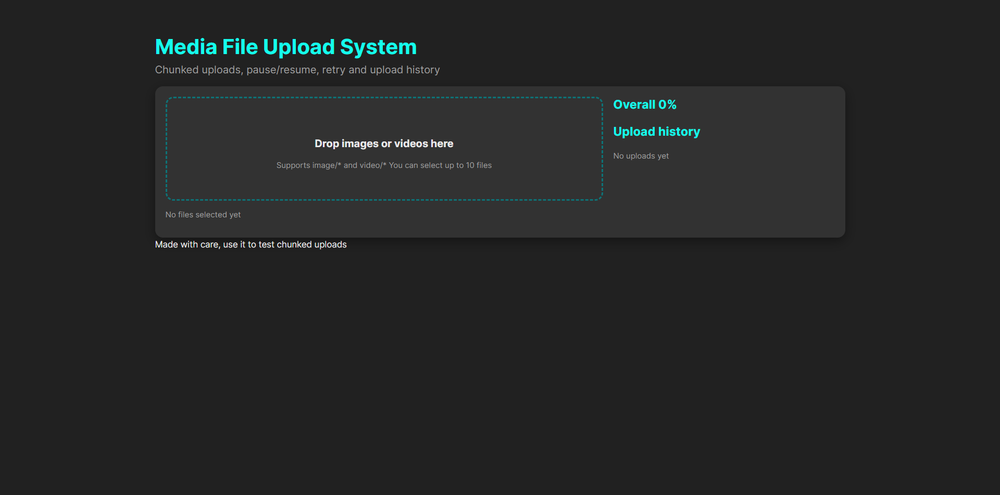
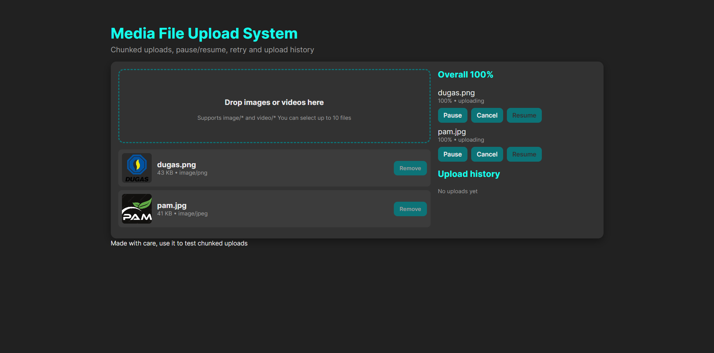
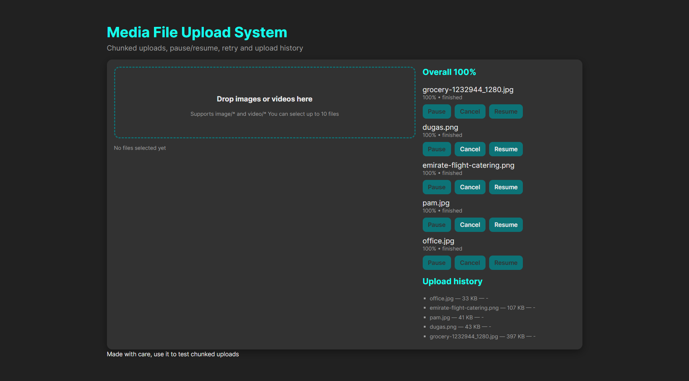

# Media File Upload System

A robust, chunked media upload system designed for large files, featuring complete control over the upload process.

The system is built with a **React** frontend and a **PHP/Symfony** backend.

## Features

* **Chunked Uploads:** Files are split and uploaded in manageable **1 MB** chunks.
* **Controllable State:** Supports **pause, resume, and cancel** of ongoing uploads.
* **Resilience:** Automatic **retry** mechanism for failed chunk transfers.
* **Parallel Processing:** Optimized with up to **3 concurrent workers** for faster transfer speeds.
* **Pre-Upload Management:** Includes file **preview** and client-side **validation**.
* **Local History:** Maintains an **upload history** stored locally in the browser.
* **Robust Backend:** Built on a reliable **Symfony/PHP** API.

## Project Structure

The repository follows a clean separation for the frontend and backend components:

```

media-upload-offline/
│
├── client/      \# React frontend (Vite)
└── server/      \# Symfony/PHP backend

````

## Requirements

### Frontend (React)

* Node.js 16+
* npm or yarn

### Backend (PHP/Symfony)

* PHP 8.1+
* Composer
* `fileinfo` extension enabled

## Getting Started

### 1. Running the Backend (Symfony/PHP)

Open your first terminal window and follow these steps:

```bash
cd server
composer install
php -S 127.0.0.1:8000 -t public
````

The backend server will be running at: **http://127.0.0.1:8000**

#### API Endpoints

The frontend interacts with the following endpoints:

| Method | Path | Description |
| :--- | :--- | :--- |
| `POST` | `/api/upload/initiate` | Registers the file and prepares for chunks. |
| `POST` | `/api/upload/chunk` | Receives and stores a file chunk. |
| `POST` | `/api/upload/finalize` | Assembles all chunks into the final file. |
| `GET` | `/api/health` | Simple health check. |

### 2\. Running the Frontend (React)

Open a second terminal window:

```bash
cd client
npm install
npm run dev
```

The frontend application will be available at: **http://localhost:5173**

> **Note:** The React application is configured to expect the backend API at `http://127.0.0.1:8000`.

## File Storage

The backend manages two types of storage locations:

| Type | Location | Notes |
| :--- | :--- | :--- |
| **Final Files** | `server/var/uploads/YYYY/MM/DD/` | Assembled, complete media files. |
| **Temporary Chunks** | `server/var/chunks/` | Individual chunk files pending assembly. |

> **Cleanup:** Old temporary chunks are automatically cleaned up by the system after **30 minutes**.

## Troubleshooting

### Uploads Not Starting

Ensure **both** the frontend and backend servers are running concurrently:

  * **React:** `http://localhost:5173`
  * **PHP/Symfony:** `http://127.0.0.1:8000`

### CORS or Network Errors

If you encounter connection issues, verify the backend base URL in the frontend (typically in `UploadManager.jsx`):

```javascript
axios.defaults.baseURL = "[http://127.0.0.1:8000](http://127.0.0.1:8000)";
```

### Symfony/Composer Errors

If the backend fails to start due to dependency issues, try rebuilding the dependencies and autoloader:

```bash
cd server
composer install
composer dump-autoload
```

## Building for Production

To create a static production build of the React frontend:

```bash
cd client
npm run build
```

The optimized static assets will be output to the: `client/dist/` directory.

## System Architecture Overview




